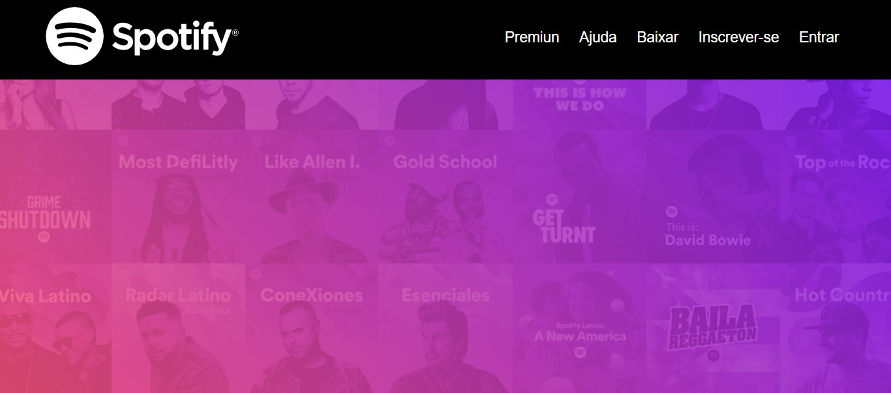
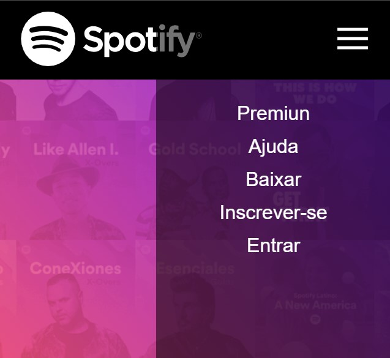

# MENU SPOTIFY
😎ESTE PROJETO EXEMPLIFICA UM MENU DE NAVEGAÇÃO INTERATIVO INSPIRADO NO DESIGN SIMPLES E FUNCIONAL DO SPOTIFY, USANDO HTML, CSS, E JAVASCRIPT.

    
  

## DESCRIÇÃO:
Este projeto exemplifica um **menu de navegação interativo** inspirado no design simples e funcional do Spotify, usando **HTML**, **CSS**, e **JavaScript**. Ele oferece uma interface responsiva, que adapta a exibição do menu conforme o tamanho da tela, além de um visual atraente com efeitos de transição suave.

## COMPONENTES PRINCIPAIS:
1. **Navegação:**
   - O menu contém links importantes como **Premium**, **Ajuda**, **Baixar**, **Inscrever-se**, e **Entrar**.
   - O logotipo do Spotify é exibido no canto esquerdo, representando a identidade visual da interface.
   - No canto direito, há um ícone de menu que, ao ser clicado em dispositivos móveis, revela o menu completo.

2. **Responsividade:**
   - Em telas maiores (desktop), os itens do menu são exibidos horizontalmente.
   - Em dispositivos menores (smartphones e tablets), o menu é acessado através de um **ícone de menu "hambúrguer"**.
   - Ao clicar no ícone, o menu é exibido verticalmente, ocupando 60% da tela no lado direito, garantindo uma experiência amigável em dispositivos móveis.

3. **Estilo Visual:**
   - O **fundo** usa uma combinação de **gradiente linear** em ângulo de 50 graus, com as cores predominantes em rosa e roxo (`#f32854d0` e `#7318f3`), além de uma imagem de fundo (background.png) que é centralizada e ajustada para cobrir toda a tela.
   - O **logotipo do Spotify** (spotify.svg) é redimensionado para caber perfeitamente no espaço designado.
   - As cores principais do texto no menu são **brancas**, e os links ganham destaque com uma animação de mudança de cor para **azul claro** ao passar o mouse.

4. **Interatividade com JavaScript:**
   - O **JavaScript** utilizado controla a funcionalidade do menu para dispositivos móveis. Quando o usuário clica no ícone de menu, o menu é exibido ou ocultado alternando a classe `open`.
   - O botão de menu também usa uma função de alternância (`toggle`) para abrir e fechar o menu suavemente, o que melhora a experiência de navegação.

5. **Em telas pequenas (menos de 770px):**
   - O menu "hambúrguer" aparece no canto direito.
   - Ao ser clicado, o menu desliza da direita para a esquerda, ocupando parte da tela com um fundo semitransparente preto.
   - Os links se reorganizam verticalmente e aumentam de tamanho para facilitar a interação em dispositivos móveis.

## NÃO SABE?
- Entendemos que para manipular arquivos em `HTML`, `CSS` e outras linguagens relacionadas, é necessário possuir conhecimento nessas áreas. Para auxiliar nesse aprendizado, oferecemos cursos gratuitos disponíveis:
* [CURSO DE HTML E CSS](https://github.com/VILHALVA/CURSO-DE-HTML-E-CSS)
* [CURSO DE JAVASCRIPT](https://github.com/VILHALVA/CURSO-DE-JAVASCRIPT)
* [CONFIRA MAIS CURSOS](https://github.com/VILHALVA?tab=repositories&q=+topic:CURSO)

## CREDITOS:
- [PROJETO CRIADO PELO "matheusmanuel"](https://github.com/matheusmanuel/Menu-responsivo-com-html-css-javasctip-versao-spotify)
- [PROJETO EDITADO PELO VILHALVA](https://github.com/VILHALVA)

